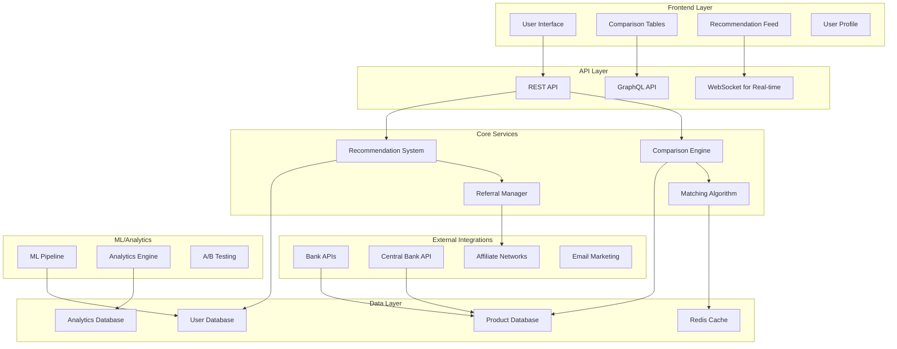

# Design Document: Comparison and Recommendation System

## Overview

Система сравнения и рекомендаций банковских продуктов для Считай.RU - это интеллектуальная платформа для подбора оптимальных финансовых решений с возможностью монетизации через реферальные программы банков. Система анализирует пользовательские расчеты, сравнивает банковские продукты и предоставляет персонализированные рекомендации.

## Architecture

### High-Level Architecture



### Technology Stack

- **Frontend**: React + TypeScript, TanStack Query для кэширования
- **Backend**: Node.js/Express + GraphQL для гибких запросов
- **Database**: PostgreSQL (Supabase) для основных данных, Redis для кэширования
- **ML/Analytics**: Python микросервисы для рекомендаций
- **Real-time**: WebSocket для живых обновлений рекомендаций
- **Monitoring**: Sentry для ошибок, Mixpanel для аналитики

## Components and Interfaces

### 1. Comparison Engine

Ядро системы сравнения банковских продуктов.

```typescript
interface ComparisonEngine {
  compareProducts(productIds: string[], criteria: ComparisonCriteria): Promise<ComparisonResult>;
  getComparisonMatrix(products: BankProduct[]): ComparisonMatrix;
  highlightBestOptions(comparison: ComparisonResult): ComparisonResult;
  filterProducts(products: BankProduct[], filters: ProductFilters): BankProduct[];
}

interface ComparisonCriteria {
  sortBy: 'rate' | 'total_cost' | 'monthly_payment' | 'rating';
  includePromotions: boolean;
  userLocation?: string;
  userProfile?: UserFinancialProfile;
}

interface ComparisonResult {
  products: BankProduct[];
  matrix: ComparisonMatrix;
  highlights: ProductHighlights;
  recommendations: string[];
  lastUpdated: Date;
}

interface ComparisonMatrix {
  headers: string[];
  rows: ComparisonRow[];
  bestInCategory: Record<string, string>; // category -> productId
}
```

### 2. Recommendation System

Система персонализированных рекомендаций на основе ML.

```typescript
interface RecommendationSystem {
  getPersonalizedRecommendations(userId: string, context: RecommendationContext): Promise<Recommendation[]>;
  updateUserProfile(userId: string, calculationData: CalculationData): Promise<void>;
  learnFromFeedback(userId: string, feedback: UserFeedback): Promise<void>;
  getExplanation(recommendationId: string): Promise<RecommendationExplanation>;
}

interface RecommendationContext {
  calculationType: 'mortgage' | 'deposit' | 'credit' | 'insurance';
  calculationParams: Record<string, any>;
  userLocation: string;
  deviceType: 'mobile' | 'desktop';
  sessionHistory: string[];
}

interface Recommendation {
  id: string;
  product: BankProduct;
  score: number; // 0-100
  reasoning: string[];
  tags: RecommendationTag[];
  estimatedSavings?: number;
  matchPercentage: number;
  referralLink: string;
  isSponsored: boolean;
}

interface RecommendationTag {
  type: 'best_rate' | 'lowest_fees' | 'fastest_approval' | 'most_popular' | 'sponsored';
  label: string;
  color: string;
}
```

### 3. Matching Algorithm

Алгоритм подбора оптимальных решений.

```typescript
interface MatchingAlgorithm {
  findOptimalProducts(requirements: UserRequirements): Promise<OptimalSolution>;
  rankProducts(products: BankProduct[], criteria: RankingCriteria): RankedProduct[];
  validateEligibility(product: BankProduct, userProfile: UserFinancialProfile): EligibilityResult;
  suggestAlternatives(requirements: UserRequirements): Promise<Alternative[]>;
}

interface UserRequirements {
  productType: 'mortgage' | 'deposit' | 'credit' | 'insurance';
  amount: number;
  term: number;
  income?: number;
  creditScore?: number;
  region: string;
  preferences: UserPreferences;
  constraints: Constraint[];
}

interface OptimalSolution {
  primaryRecommendation: RankedProduct;
  alternatives: RankedProduct[];
  reasoning: OptimizationReasoning;
  totalSavings: number;
  riskAssessment: RiskLevel;
  nextSteps: ActionStep[];
}

interface RankedProduct {
  product: BankProduct;
  rank: number;
  score: number;
  pros: string[];
  cons: string[];
  eligibilityScore: number;
  referralValue: number;
}
```

### 4. Referral Manager

Система управления реферальными ссылками и монетизацией.

```typescript
interface ReferralManager {
  generateReferralLink(productId: string, userId: string, context: ReferralContext): Promise<string>;
  trackClick(referralId: string, metadata: ClickMetadata): Promise<void>;
  trackConversion(referralId: string, conversionData: ConversionData): Promise<void>;
  getCommissionStructure(bankId: string): Promise<CommissionStructure>;
  generateReport(period: DateRange, filters: ReportFilters): Promise<ReferralReport>;
}

interface ReferralContext {
  source: 'comparison' | 'recommendation' | 'calculator' | 'blog';
  campaign?: string;
  placement: string;
  userSegment: string;
}

interface ConversionData {
  applicationId: string;
  productId: string;
  userId: string;
  amount: number;
  status: 'applied' | 'approved' | 'funded';
  commissionAmount: number;
  conversionTime: Date;
}

interface CommissionStructure {
  bankId: string;
  productTypes: Record<string, CommissionRate>;
  bonuses: CommissionBonus[];
  paymentTerms: PaymentTerms;
}
```

## Data Models

### Bank Product Schema

```sql
-- Таблица банковских продуктов
CREATE TABLE bank_products (
  id UUID PRIMARY KEY DEFAULT gen_random_uuid(),
  bank_id UUID NOT NULL REFERENCES banks(id),
  product_type VARCHAR(50) NOT NULL, -- 'mortgage', 'deposit', 'credit', 'insurance'
  name VARCHAR(255) NOT NULL,
  description TEXT,
  
  -- Основные параметры
  interest_rate DECIMAL(5,2) NOT NULL,
  min_amount DECIMAL(15,2),
  max_amount DECIMAL(15,2),
  min_term INTEGER, -- в месяцах
  max_term INTEGER,
  
  -- Комиссии и условия
  fees JSONB, -- {"application": 1000, "monthly": 500}
  requirements JSONB, -- {"min_income": 50000, "min_age": 21}
  features JSONB, -- {"early_repayment": true, "grace_period": 55}
  
  -- Промо-условия
  promotional_rate DECIMAL(5,2),
  promo_valid_until DATE,
  promo_conditions TEXT,
  
  -- Региональность
  available_regions TEXT[], -- ['moscow', 'spb', 'all']
  
  -- Метаданные
  is_active BOOLEAN DEFAULT true,
  is_featured BOOLEAN DEFAULT false,
  priority INTEGER DEFAULT 0,
  created_at TIMESTAMP DEFAULT NOW(),
  updated_at TIMESTAMP DEFAULT NOW(),
  
  -- Индексы для быстрого поиска
  CONSTRAINT valid_product_type CHECK (product_type IN ('mortgage', 'deposit', 'credit', 'insurance'))
);

-- Таблица банков
CREATE TABLE banks (
  id UUID PRIMARY KEY DEFAULT gen_random_uuid(),
  name VARCHAR(255) NOT NULL,
  short_name VARCHAR(100) NOT NULL,
  logo_url TEXT,
  website_url TEXT,
  
  -- Рейтинги
  overall_rating DECIMAL(3,2), -- 0.00-5.00
  customer_service_rating DECIMAL(3,2),
  reliability_rating DECIMAL(3,2),
  processing_speed_rating DECIMAL(3,2),
  
  -- Контактная информация
  phone VARCHAR(20),
  email VARCHAR(255),
  address TEXT,
  
  -- Лицензии и регулирование
  license_number VARCHAR(50),
  central_bank_code VARCHAR(20),
  
  -- Партнерство
  is_partner BOOLEAN DEFAULT false,
  commission_rate DECIMAL(5,2), -- процент комиссии
  referral_terms TEXT,
  
  created_at TIMESTAMP DEFAULT NOW(),
  updated_at TIMESTAMP DEFAULT NOW()
);

-- Таблица пользовательских профилей
CREATE TABLE user_profiles (
  id UUID PRIMARY KEY DEFAULT gen_random_uuid(),
  user_id UUID NOT NULL,
  
  -- Финансовая информация
  monthly_income DECIMAL(12,2),
  credit_score INTEGER,
  employment_type VARCHAR(50), -- 'employee', 'self_employed', 'unemployed'
  region VARCHAR(100),
  age_range VARCHAR(20), -- '18-25', '26-35', etc.
  
  -- Предпочтения
  risk_tolerance VARCHAR(20), -- 'low', 'medium', 'high'
  preferred_banks UUID[],
  blacklisted_banks UUID[],
  
  -- История расчетов
  calculation_history JSONB,
  product_interests TEXT[], -- ['mortgage', 'deposit']
  
  -- Поведенческие данные
  last_active TIMESTAMP,
  session_count INTEGER DEFAULT 0,
  conversion_count INTEGER DEFAULT 0,
  
  created_at TIMESTAMP DEFAULT NOW(),
  updated_at TIMESTAMP DEFAULT NOW()
);

-- Таблица рекомендаций
CREATE TABLE recommendations (
  id UUID PRIMARY KEY DEFAULT gen_random_uuid(),
  user_id UUID NOT NULL,
  product_id UUID NOT NULL REFERENCES bank_products(id),
  
  -- Параметры рекомендации
  score DECIMAL(5,2) NOT NULL, -- 0-100
  reasoning TEXT[],
  context JSONB, -- контекст, в котором была сделана рекомендация
  
  -- Взаимодействие пользователя
  shown_at TIMESTAMP DEFAULT NOW(),
  clicked_at TIMESTAMP,
  dismissed_at TIMESTAMP,
  applied_at TIMESTAMP,
  
  -- Реферальная информация
  referral_link TEXT,
  referral_id UUID,
  commission_potential DECIMAL(10,2),
  
  -- Метаданные
  recommendation_type VARCHAR(50), -- 'automatic', 'manual', 'promoted'
  source VARCHAR(50), -- 'calculator', 'comparison', 'profile'
  
  created_at TIMESTAMP DEFAULT NOW()
);

-- Таблица сравнений
CREATE TABLE comparisons (
  id UUID PRIMARY KEY DEFAULT gen_random_uuid(),
  user_id UUID,
  
  -- Сравниваемые продукты
  product_ids UUID[] NOT NULL,
  comparison_criteria JSONB,
  
  -- Результаты
  comparison_matrix JSONB,
  highlighted_products UUID[],
  
  -- Взаимодействие
  saved_at TIMESTAMP,
  shared_at TIMESTAMP,
  bookmark_id UUID,
  
  created_at TIMESTAMP DEFAULT NOW(),
  updated_at TIMESTAMP DEFAULT NOW()
);

-- Таблица реферальной аналитики
CREATE TABLE referral_analytics (
  id UUID PRIMARY KEY DEFAULT gen_random_uuid(),
  referral_id UUID NOT NULL,
  user_id UUID,
  product_id UUID NOT NULL,
  bank_id UUID NOT NULL,
  
  -- События
  event_type VARCHAR(50) NOT NULL, -- 'click', 'view', 'apply', 'approve', 'fund'
  event_timestamp TIMESTAMP DEFAULT NOW(),
  
  -- Контекст
  source VARCHAR(50), -- 'comparison', 'recommendation', 'blog'
  campaign VARCHAR(100),
  user_agent TEXT,
  ip_address INET,
  
  -- Финансовые данные
  potential_commission DECIMAL(10,2),
  actual_commission DECIMAL(10,2),
  commission_status VARCHAR(20), -- 'pending', 'confirmed', 'paid'
  
  -- Метаданные
  metadata JSONB,
  created_at TIMESTAMP DEFAULT NOW()
);
```

## Correctness Properties

*A property is a characteristic or behavior that should hold true across all valid executions of a system-essentially, a formal statement about what the system should do. Properties serve as the bridge between human-readable specifications and machine-verifiable correctness guarantees.*

### Property 1: Comparison Data Completeness
*For any* set of bank products being compared, the comparison table should display all required fields (rates, terms, fees) for each product type
**Validates: Requirements 1.2, 1.3**

### Property 2: Best Option Highlighting Accuracy
*For any* product comparison, the system should correctly identify and highlight the best option for each parameter (lowest rate, highest return, etc.)
**Validates: Requirements 1.4**

### Property 3: Real-time Filter Updates
*For any* filter applied to comparison results, the display should update immediately without requiring page refresh
**Validates: Requirements 1.5**

### Property 4: Recommendation Relevance
*For any* user who completes a calculator, the recommended products should match their calculation parameters and financial profile
**Validates: Requirements 2.1, 2.2, 2.3**

### Property 5: Cross-Calculator Recommendation Integration
*For any* user who uses multiple calculators, the system should provide comprehensive recommendations considering all their financial needs
**Validates: Requirements 2.4**

### Property 6: Location-Based Product Filtering
*For any* user recommendation, only products available in the user's region should be suggested
**Validates: Requirements 2.7**

### Property 7: Rating Calculation Consistency
*For any* bank rating, it should be calculated consistently using customer service, product terms, processing speed, and reliability metrics
**Validates: Requirements 3.1, 3.2**

### Property 8: Rating Propagation Accuracy
*For any* bank rating change, all related product displays and comparisons should reflect the updated rating
**Validates: Requirements 3.4**

### Property 9: Optimal Solution Comprehensiveness
*For any* user financial parameters, the matching algorithm should analyze all available products and consider total cost, monthly payments, and user preferences
**Validates: Requirements 4.1, 4.2**

### Property 10: Constraint Handling Completeness
*For any* strict user constraints, the system should either find products meeting all requirements or provide clear explanations why none exist
**Validates: Requirements 4.4**

### Property 11: Referral Link Tracking Accuracy
*For any* product recommendation with referral links, clicks should be properly tracked through the referral system
**Validates: Requirements 5.1, 5.2**

### Property 12: Affiliate Transparency
*For any* product display, sponsored or partner products should be clearly indicated to maintain transparency
**Validates: Requirements 5.4, 5.7**

### Property 13: Product Data Validation
*For any* new product added to the database, all required parameters should be validated for accuracy and completeness
**Validates: Requirements 6.1, 6.4**

### Property 14: Data Source Prioritization
*For any* product data conflict, official bank sources should take priority over other data sources
**Validates: Requirements 6.8**

### Property 15: User Profile Persistence
*For any* user calculation or preference change, the data should be stored in the user profile and applied to future recommendations
**Validates: Requirements 7.1, 7.3**

### Property 16: Calculator Integration Seamlessness
*For any* completed calculation, relevant product recommendations should be automatically suggested with pre-filled application data
**Validates: Requirements 8.1, 8.2**

### Property 17: Real-time Recommendation Updates
*For any* calculation modification, product recommendations should update immediately to reflect the new parameters
**Validates: Requirements 8.3**

### Property 18: Cross-Platform State Synchronization
*For any* user switching between devices, their comparison state and preferences should be maintained across platforms
**Validates: Requirements 9.7**

### Property 19: Analytics Data Accuracy
*For any* user interaction with recommendations, the system should accurately track clicks, views, and conversions for analytics
**Validates: Requirements 10.1, 10.3**

### Property 20: Revenue Tracking Completeness
*For any* referral conversion, the system should track commission earnings and provide detailed revenue analytics
**Validates: Requirements 10.6**

## Error Handling

### Data Integrity Errors
- **Missing Product Data**: Fallback to cached data, notify admins
- **Invalid Calculations**: Validate inputs, show error messages
- **API Failures**: Retry with exponential backoff, use cached data

### User Experience Errors
- **No Recommendations Found**: Suggest relaxing constraints, show popular products
- **Comparison Limit Exceeded**: Allow removing products, suggest focusing on top options
- **Mobile Performance Issues**: Lazy load data, optimize images

### Business Logic Errors
- **Referral Link Failures**: Log errors, provide direct bank links as fallback
- **Commission Tracking Issues**: Queue for retry, alert finance team
- **Rating Calculation Errors**: Use previous ratings, schedule recalculation

## Testing Strategy

### Unit Testing
- Тестирование алгоритмов сравнения и рекомендаций
- Валидация бизнес-логики расчетов
- Проверка обработки ошибок и граничных случаев

### Property-Based Testing
- Минимум 100 итераций для каждого property test
- Использование fast-check для генерации тестовых данных
- Каждый property test должен ссылаться на соответствующее свойство

**Property Test Configuration:**
```typescript
describe('Comparison and Recommendation Properties', () => {
  it('should display complete product data in comparisons', 
    fc.property(
      fc.array(bankProductArbitrary, { minLength: 2, maxLength: 5 }),
      async (products) => {
        // Feature: comparison-recommendation-system, Property 1: Comparison Data Completeness
        const comparison = await comparisonEngine.compareProducts(
          products.map(p => p.id), 
          defaultCriteria
        );
        
        products.forEach(product => {
          expect(comparison.matrix.rows.find(r => r.productId === product.id))
            .toHaveProperty('interestRate');
          expect(comparison.matrix.rows.find(r => r.productId === product.id))
            .toHaveProperty('terms');
          expect(comparison.matrix.rows.find(r => r.productId === product.id))
            .toHaveProperty('fees');
        });
      }
    ), 
    { numRuns: 100 }
  );
});
```

### Integration Testing
- Тестирование интеграции с банковскими API
- Проверка работы реферальных ссылок
- Тестирование ML-модели рекомендаций

### Performance Testing
- Нагрузочное тестирование сравнения большого количества продуктов
- Тестирование времени отклика рекомендательной системы
- Проверка производительности на мобильных устройствах

## Implementation Phases

### Phase 1: Core Infrastructure (Week 1-2)
- Настройка базы данных и API
- Базовая система сравнения продуктов
- Простые рекомендации на основе расчетов

### Phase 2: Advanced Comparison (Week 3-4)
- Расширенные фильтры и сортировка
- Система рейтингов банков
- Мобильная оптимизация сравнений

### Phase 3: ML Recommendations (Week 5-6)
- Машинное обучение для персонализации
- Алгоритм подбора оптимальных решений
- A/B тестирование рекомендаций

### Phase 4: Referral System (Week 7-8)
- Система реферальных ссылок
- Отслеживание конверсий
- Аналитика доходов

### Phase 5: Advanced Features (Week 9-10)
- Интеграция с банковскими API
- Автоматическое обновление данных
- Расширенная аналитика

### Phase 6: Optimization (Week 11-12)
- Оптимизация производительности
- Улучшение ML-модели
- Масштабирование системы

## Revenue Model

### Commission Structure
- **Ипотека**: 0.1-0.3% от суммы кредита
- **Вклады**: 0.05-0.1% от суммы вклада
- **Кредиты**: 1-3% от суммы кредита
- **Страхование**: 10-20% от годовой премии

### Expected Revenue
- **Месяц 1-3**: $500-1,500 (тестирование)
- **Месяц 4-6**: $2,000-5,000 (рост трафика)
- **Месяц 7-12**: $5,000-15,000 (оптимизация)
- **Год 2**: $20,000-50,000 (масштабирование)

### Key Metrics
- **Conversion Rate**: 2-5% от показов рекомендаций
- **Average Commission**: $50-200 за конверсию
- **Monthly Active Users**: 10,000-50,000
- **Revenue per User**: $1-3 в месяц

## Security and Compliance

### Data Protection
- Шифрование персональных финансовых данных
- Соблюдение PCI DSS для обработки платежных данных
- Регулярные аудиты безопасности

### Regulatory Compliance
- Соответствие требованиям ЦБ РФ
- Прозрачность реферальных отношений
- Защита прав потребителей финансовых услуг

### Privacy Controls
- Возможность удаления персональных данных
- Контроль над использованием данных для рекомендаций
- Прозрачная политика конфиденциальности