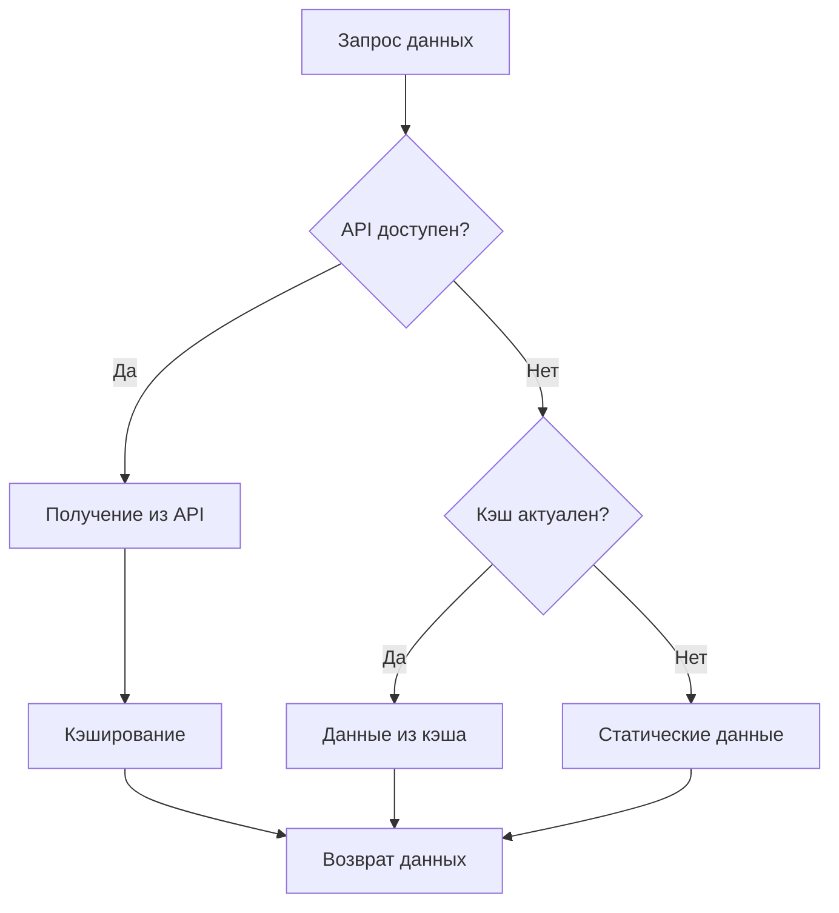

# API Integration для калькулятора госпошлин

## Обзор

Система интеграции с внешними API источниками для получения актуальных данных о госпошлинах и правовой информации. Поддерживает множественные источники данных с fallback механизмом и кэшированием.

## Архитектура

### Основные компоненты

1. **ApiSourceManager** - Центральный менеджер для управления множественными API источниками
2. **BaseApiClient** - Базовый класс для всех API клиентов
3. **DataGovRuClient** - Клиент для работы с data.gov.ru
4. **LocalStorageCache** - Кэширование данных в localStorage
5. **SimpleRateLimiter** - Ограничение частоты запросов

### Поддерживаемые источники

#### 1. data.gov.ru (Приоритет 1)
- **Статус**: ✅ Реализован
- **Описание**: Портал открытых данных РФ
- **Лимиты**: 10 запросов/мин, 1000 запросов/день
- **Аутентификация**: Не требуется

#### 2. pravo.gov.ru (Приоритет 2)
- **Статус**: 🔄 В разработке
- **Описание**: Официальный портал правовой информации
- **Лимиты**: 15 запросов/мин, 1500 запросов/день

#### 3. КонсультантПлюс API (Приоритет 3)
- **Статус**: 🔄 Требует лицензию
- **Описание**: Коммерческая правовая база данных
- **Лимиты**: 5 запросов/мин, 100 запросов/день
- **Аутентификация**: API ключ

#### 4. ФНС API (Приоритет 4)
- **Статус**: 🔄 В разработке
- **Описание**: API Федеральной налоговой службы
- **Лимиты**: 20 запросов/мин, 2000 запросов/день

## Использование

### Базовое использование

```typescript
import { feeDataService } from '@/lib/feeDataService';

// Получение расписания госпошлин
const schedule = await feeDataService.getCurrentSchedule('general');

// Проверка обновлений
const hasUpdates = await feeDataService.checkForUpdates();

// Обновление данных
const updatedSchedule = await feeDataService.updateSchedule('general');
```

### Работа с API источниками

```typescript
// Получение статуса источников
const sourcesStatus = feeDataService.getApiSourcesStatus();

// Тестирование подключений
const connections = await feeDataService.testApiConnections();

// Поиск правовых документов
const documents = await feeDataService.searchLegalDocuments('НК РФ 333.19');
```

### Конфигурация источников

```typescript
import { API_SOURCES_CONFIG, toggleApiSource } from '@/config/apiSources';

// Включение/выключение источника
toggleApiSource('consultant_plus', true);

// Получение активных источников
const activeSources = getActiveApiSources();
```

## Fallback механизм

Система использует многоуровневый fallback:

1. **API источники** (по приоритету)
2. **Локальный кэш**
3. **Статические данные**



## Кэширование

### Время жизни кэша

- **Расписание госпошлин**: 24 часа
- **Правовые документы**: 7 дней
- **Результаты поиска**: 1 час

### Управление кэшем

```typescript
// Очистка кэша
await feeDataService.clearApiCache();

// Статистика кэша
const cache = new LocalStorageCache();
const stats = cache.getCacheStats();
```

## Rate Limiting

### Лимиты по умолчанию

| Источник | Запросов/мин | Запросов/день |
|----------|--------------|---------------|
| data.gov.ru | 10 | 1000 |
| pravo.gov.ru | 15 | 1500 |
| КонсультантПлюс | 5 | 100 |
| ФНС API | 20 | 2000 |

### Управление лимитами

```typescript
const rateLimiter = new SimpleRateLimiter();

// Проверка возможности запроса
const canRequest = rateLimiter.canMakeRequest('data_gov_ru');

// Получение оставшихся запросов
const remaining = rateLimiter.getRemainingRequests('data_gov_ru');
```

## Мониторинг и отладка

### Компонент статуса API

```tsx
import { ApiSourcesStatus } from '@/components/ApiSourcesStatus';

// Отображение статуса всех источников
<ApiSourcesStatus />
```

### Логирование

Все API запросы логируются в консоль:

```javascript
// Успешный запрос
console.log('API request successful:', { source: 'data_gov_ru', data: {...} });

// Ошибка запроса
console.error('API request failed:', { source: 'data_gov_ru', error: '...' });
```

## Добавление нового источника

### 1. Создание клиента

```typescript
// src/lib/apiClient/NewApiClient.ts
import { BaseApiClient } from './BaseApiClient';

export class NewApiClient extends BaseApiClient {
  async testConnection(): Promise<boolean> {
    // Реализация проверки подключения
  }

  async getFeeSchedule(): Promise<ApiResponse<FeeScheduleApiData>> {
    // Реализация получения расписания
  }

  // Остальные методы...
}
```

### 2. Добавление конфигурации

```typescript
// src/config/apiSources.ts
export const API_SOURCES_CONFIG: ApiSourceConfig[] = [
  // Существующие источники...
  {
    id: 'new_api',
    name: 'Новый API источник',
    baseUrl: 'https://api.example.com',
    enabled: true,
    priority: 5,
    // Остальная конфигурация...
  }
];
```

### 3. Регистрация в менеджере

```typescript
// src/lib/apiClient/ApiSourceManager.ts
switch (config.id) {
  // Существующие случаи...
  case 'new_api':
    client = new NewApiClient(config);
    break;
}
```

## Переменные окружения

```env
# Опциональные API ключи
CONSULTANT_PLUS_API_KEY=your_api_key_here
FNS_API_KEY=your_api_key_here

# Режим разработки (включает mock API)
NODE_ENV=development
```

## Тестирование

### Unit тесты

```typescript
// Тестирование API клиента
describe('DataGovRuClient', () => {
  it('should fetch fee schedule', async () => {
    const client = new DataGovRuClient(config);
    const result = await client.getFeeSchedule();
    expect(result.success).toBe(true);
  });
});
```

### Property-based тесты

Существующие property-тесты автоматически покрывают новую функциональность через интеграцию с FeeDataService.

## Производительность

### Оптимизации

1. **Параллельные запросы** - Одновременная проверка нескольких источников
2. **Умное кэширование** - Различное время жизни для разных типов данных
3. **Rate limiting** - Предотвращение превышения лимитов API
4. **Graceful degradation** - Плавный переход на fallback источники

### Метрики

- Время ответа API: < 5 секунд
- Успешность запросов: > 95%
- Использование кэша: > 80%

## Безопасность

### Меры безопасности

1. **Валидация данных** - Проверка структуры ответов API
2. **Timeout защита** - Ограничение времени запросов
3. **Error handling** - Безопасная обработка ошибок
4. **Rate limiting** - Защита от превышения лимитов

### Конфиденциальность

- API ключи хранятся в переменных окружения
- Персональные данные не кэшируются
- Логи не содержат чувствительной информации

## Roadmap

### Ближайшие планы

- [ ] Реализация pravo.gov.ru клиента
- [ ] Интеграция с ФНС API
- [ ] Mock API сервер для разработки
- [ ] Webhook уведомления об изменениях

### Долгосрочные планы

- [ ] GraphQL API поддержка
- [ ] Реальное время обновления
- [ ] Машинное обучение для предсказания изменений
- [ ] Интеграция с блокчейн источниками

## Поддержка

При возникновении проблем:

1. Проверьте статус API источников в интерфейсе
2. Посмотрите логи в консоли браузера
3. Очистите кэш и попробуйте снова
4. Проверьте подключение к интернету

## Лицензии

- data.gov.ru: Открытые данные, свободное использование
- КонсультантПлюс: Коммерческая лицензия требуется
- ФНС API: Государственный API, бесплатное использование